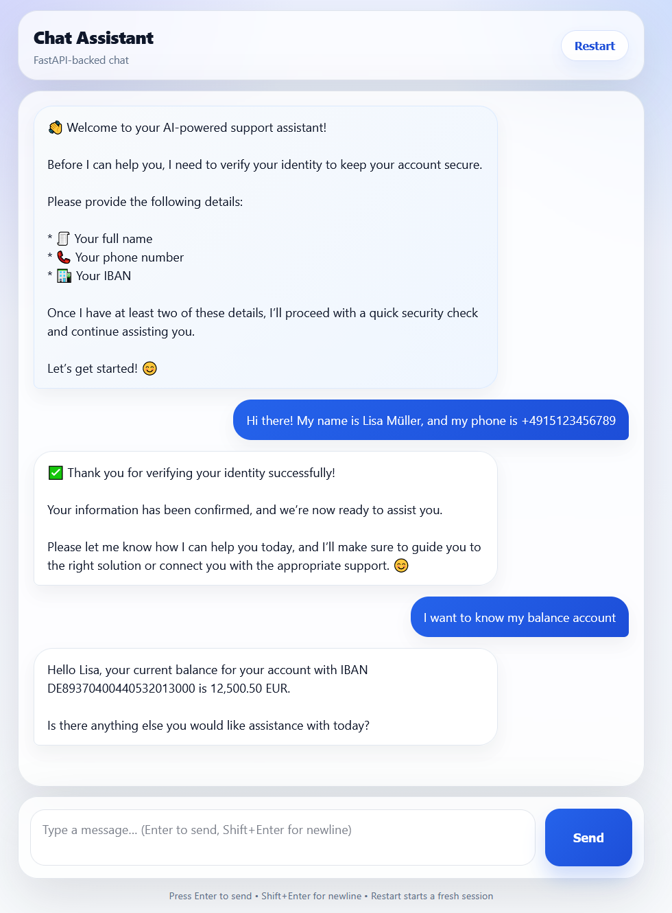
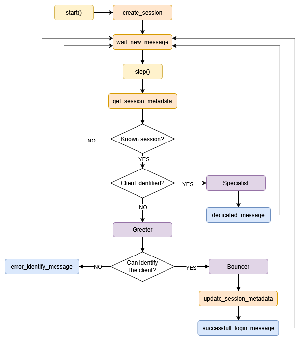

# Bank Chat

A Proof of Concept (POC) for a modular, general-purpose banking chat system with user authentication and personalized 
data access.

This solution implements a highly configurable chat that authenticates users either through regex-based matching or by 
prompting them to provide structured information that fits a predefined schema. Once authenticated, users can query 
their personal data. As a POC, only a limited set of use cases is currently supported.

All functionality is exposed through a FastAPI-based API and can be accessed via a user interface built with 
[Dash](https://dash.plotly.com/).


<details><summary>Click here to see an example of the chat Dash app</summary>


</details>

<details><summary>Click here to see a diagram with the workflow of the deployed system</summary>


</details>

---

## Architecture Overview

The system consists of:

- **FastAPI Endpoints**
- **Session management and storage**
- **Modular LLM inference layer**
- **Agent orchestration and tool execution**

> **Note:** As a POC, production-level features like secure data exchange and session termination are not yet implemented.

### FastAPI Endpoints

- `/health`  
  Performs a health check.

- `/config`  
  Displays the orchestrator configuration.

- `/start`  
  Initializes a new chat session and returns a session ID.

- `/message`  
  Sends a message and receives a response.

### Session and Storage

The system supports multiple concurrent sessions, storing both conversation history and the associated authenticated 
user per session. The storage mechanism is abstracted, allowing easy replacement or extension by implementing the 
provided base classes.

A mock database reads data from [dataset_example](database_example/dataset_example.json) and provides basic 
functionality. It can be swapped with other data sources or formats as needed.

<details><summary>Click here to see some examples of this mock database</summary>

```json
[
  {
    "name": "Lisa Müller",
    "phone": "+4915123456789",
    "customer_type": "premium",
    "risk_level": "low",
    "preferred_language": "de",
    "accounts": [
      {
        "iban": "DE89370400440532013000",
        "balance": 12500.50,
        "currency": "EUR"
      }
    ],
    "history": [
      {"topic": "card issue", "date": "2025-01-10"}
    ],
    "intents": ["support"]
  },
  {
    "name": "John Smith",
    "phone": "+11234567890",
    "customer_type": "regular",
    "risk_level": "medium",
    "preferred_language": "en",
    "accounts": [
      {
        "iban": "US12345678901234567890",
        "balance": 3200.75,
        "currency": "USD"
      }
    ],
    "history": [],
    "intents": ["transfer"]
  }
]
```
</details>

### LLM Inference

The inference layer is modular. This implementation uses OpenAI as the provider, but it can be replaced with any 
compatible service. You must provide an OpenAI API key via a `.env` file to run the system.

### Agent Orchestration

Agents are modular and coordinated through [orchestrator.py](core/orchestrator.py).  

- **Greeter Agent**: Collects user identification data and guides authentication.  
- **Specialist Agent**: Handles user requests, it starts by preprocessing the users intents, and detects the malicious 
user input. Once preprocessed, it routes the message to appropriate tools, and ensures access is restricted to 
the authenticated user's data.

---

## Usage

The application is packaged as a Docker image and can be run using `docker-compose`. Ports and environment variables can be configured in `docker-compose.yml`.

### Run the system

```bash
docker compose up --build
```

### Environment Variables

- `OPENAI_API_KEY`: API key used to authenticate requests to the OpenAI service.  
- `FASTAPI_BASE_URL`: Base URL where the FastAPI backend is accessible.  
- `SESSION_EXPIRE_TIME_THRESHOLD`: Time (in seconds) before an inactive session expires.  
- `DASH_HOST`: Host address where the Dash app is served.  
- `DASH_PORT`: Port where the Dash app is exposed.
- `FASTAPI_BASE_URL`: URL to find the bank FastApi functionality

### Access Points

Once the system is running, you can access:

- FastAPI Swagger UI: `<host>:<port>/docs#`
- Dash application: Available at the configured `http://<DASH_HOST>:<DASH_PORT>`
